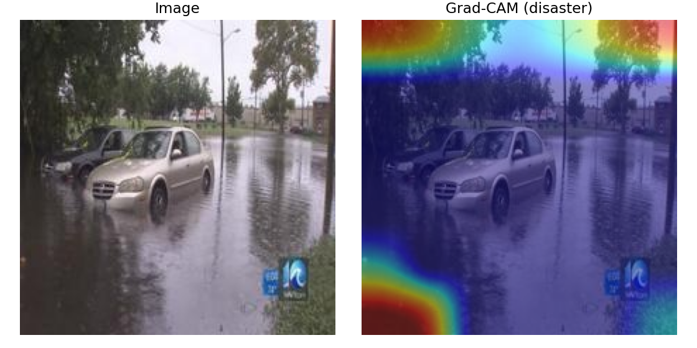
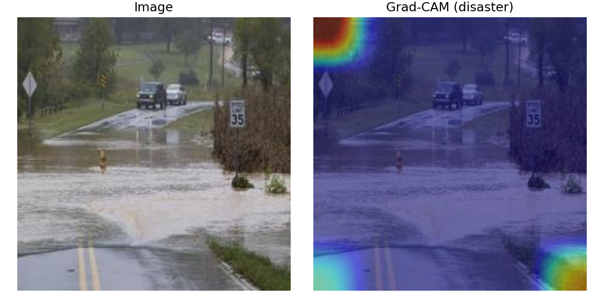
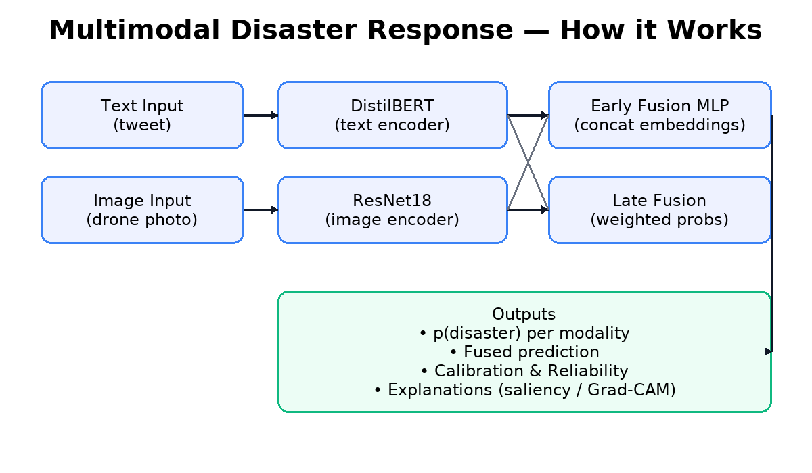

MIT License

Copyright (c) 2025 Sarah

Permission is hereby granted, free of charge, to any person obtaining a copy...
[standard MIT text continues]


<p align="left">
  <a href="https://www.python.org/"></a>
  <a href="https://pytorch.org/"></a>
  <a href="https://huggingface.co/"></a>
  <a href="https://streamlit.io/"></a>
</p>


# 🌍 Multimodal Disaster Response AI

> **Proof-of-concept AI system for flood disaster detection using both text (tweets) and images (drone photos).**

This project demonstrates how Natural Language Processing (NLP) and Computer Vision (CV) can be combined into a **multimodal AI pipeline** for disaster response scenarios.  
It was developed as a portfolio-quality project to showcase practical data science and engineering skills for internship applications (e.g., Google STEP/AI Residency).

---

## ✨ Features
- **Text Classification**: Distinguish between disaster vs. non-disaster tweets.
- **Image Classification**: Distinguish between flooded vs. non-flooded drone photos.
- **Fusion Model**: Combine text + image embeddings for improved accuracy.
- **Balanced Datasets**: Stratified, deduplicated, reproducible splits.
- **Reproducibility**: Config + seed utilities for deterministic runs.
- **Interactive Demo**: Planned Streamlit app for exploring results.

---

## 🚀 Demo

We provide a [Streamlit](https://streamlit.io) app to interactively test the models.

### Run locally
```bash
streamlit run app.py

### Demo Screenshots
Single-sample demo:  
(docs/demo_single.png)

Batch demo:  
(docs/demo_batch.png)

## 📊 Results (Test Set)

| Model             | Accuracy | Precision | Recall | F1   |
|------------------ |----------|-----------|--------|------|
| Text (DistilBERT) | 81.2%    | 0.795     | 0.758  | 0.776 |
| Image (ResNet18)  | 96.6%    | 0.948     | 0.986  | 0.967 |
| Fusion (MLP)      | 83.9%    | 0.860     | 0.754  | 0.803 |
| Fusion (Late)     | 83.2%    | 0.833     | 0.769  | 0.800 |


### 🌍 Geo-Map Demo
We added a small visualization of model predictions on a map.  
*Note: coordinates are synthetic for demo purposes only.*  

(docs/map.png)


## 🔍 Interpretability

To better understand model decisions, we visualized both **text** and **image** predictions.

### Text (DistilBERT – Saliency)
- Highlighted tokens contribute most to the prediction.
- Disaster predictions highlight words like *“storm”*, *“fire”*, *“drowned”*.
- False positives often triggered by sensational words in news/policy headlines.

👉 Open [`docs/interpretability/text_saliency.html`](docs/interpretability/text_saliency.html) to explore interactive examples.

### Images (ResNet18 – Grad-CAM)
- Grad-CAM heatmaps highlight image regions driving predictions.
- Correct positives: flooded roads, waterlines strongly activated.
- False positives: reflections / wet asphalt confused as floods.

Sample Grad-CAM overlays:

<p align="center">
  
  
</p>


### 🧪 Stress Tests (Robustness)

While the model performs well on benchmark datasets, we observed the following failure modes in adversarial testing:

- **Figurative text**: Phrases like “concert was fire” or “song Hurricane” are usually handled correctly but show lower confidence, indicating vulnerability to sarcasm/metaphor.
- **Edge-case images**: Scenes such as swimming pools, wet roads, or reflective glass buildings may cause confusion, as they visually resemble water-related disasters.
- **Uncertainty on borderline cases**: Certain non-disaster inputs still yield moderate disaster probability (e.g., wet roads at 0.32).

➡️ See (docs/limitations.md) for detailed examples and discussion.


